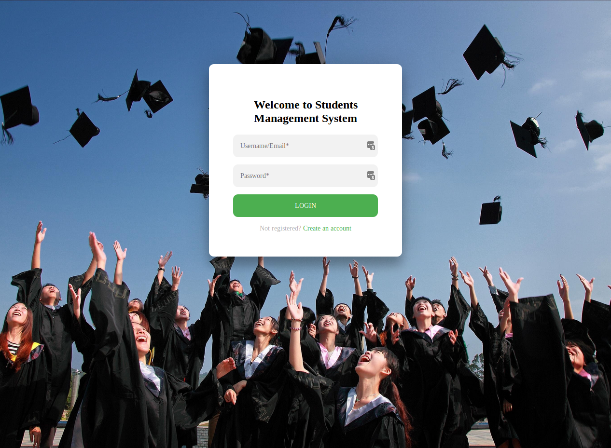
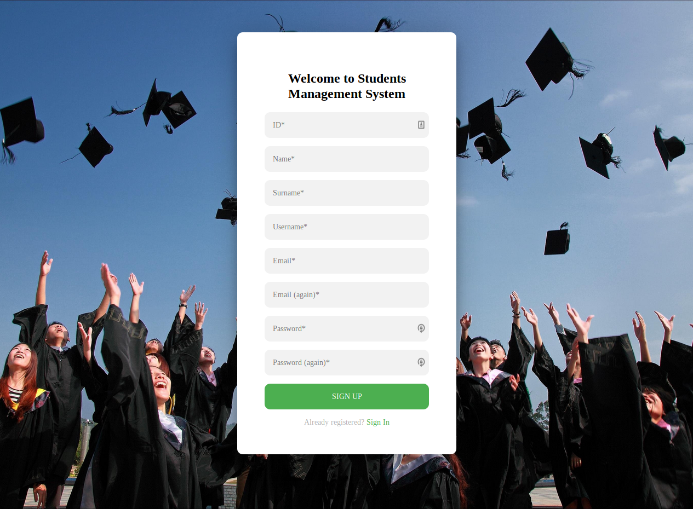
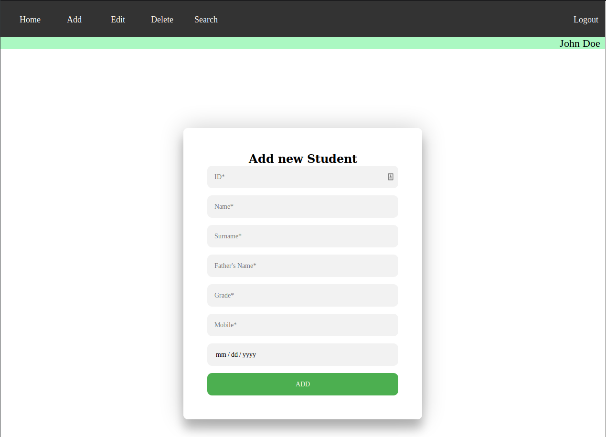
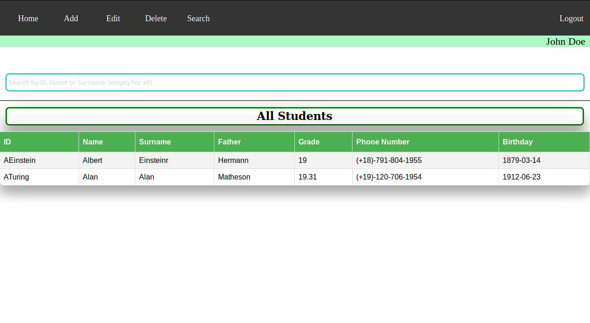
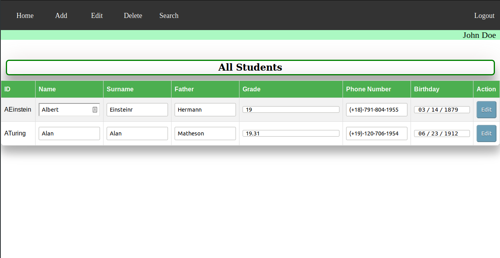
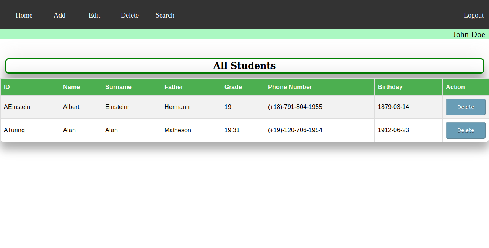

# simple-students-system  

This project is an educational implementation of a simple students administration system web application.



## Learning objectives of the project
* Design Microservices Architecture with Docker Containers.
* Use PHP as a server side programming language. 
* Pure HTML, CSS and Javascript usage for cliend side design. 
* CRUD functionality with the help of UI in front-end.

## Documentation
If you want more information you could read (or just try to read, unfortunately at this point is only in greek language) the following report file: [Report](./doc/report.pdf)

### Enviroment
In order to run this project you sould have already installed docker v19.03.4 or later and docker-compose v1.24.0 or later (at least that's what i used).

#### Usage
1) Clone project : `git clone https://https://github.com/CSpyridakis/simple-students-system.git`
2) Change directory to project `cd simple-students-system`
3) Run `docker-compose up`
4) Visit `http://localhost:8080/`
5) Register new Teacher or use the following credentials for login.
```
Username: JDoe_1
Password: johnPass1
```
#### Database
During `docker-compose up` containers are created. Mysql gets initialized by this dummy [file](./mysql/students_administration_system_db.sql) which contains schema of DB with three Students and two Teachers stored.

Then a complete database backup is created on this directory: ./mysql/data

##### IMPORTANT
* Database's backup owner is root. In order to delete or move project to a different machine (with already stored data in it) you have to change ower of this directory by executing `sudo chown $USER:$USER ./mysql/data -R`.

* PhpmyAdmin is available by visiting `http://localhost:8081/`
* Database credentials are stored on this file: [.env](.env)
* PhpmyAdmin uses database credentials

**NEVER** upload .env file of a production server online.

### Operations
#### Register new Teacher


#### Add new Student (Create)


#### Search Student (Read)


#### Edit Student (Update)


#### Remove Student (Delete)


## Future work
* Save hashes of passwords in database
* UI and UX upgrades
* Security issues fix
* Add TLS
